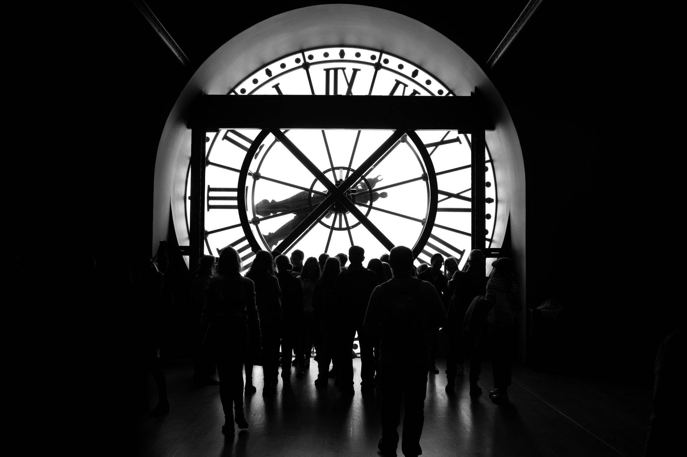

As a novice photographer myself, I do not profess to speak with authority on this subject. However, I'm hoping you can gain from some of the advice I've picked up during my journey. 

## Shoot as much as you can

*“Your first 10,000 photos are your worst” - Henri Cartier-Bresson*

As you start out, most of the photos you take will not be great, as I know from experience. I’m sure if I look back at even my current photos in a couple of years, I will find them to be mediocre. 

Of course, 10,000 is an arbitrary number, but the idea of going out to shoot as much as you can holds a lot of weight. When I go out to shoot, I learn something new as I face unexpected challenges and conditions.   

For example, a couple of weeks after getting my first camera, I took it with me to take photos at my brother’s graduation. The event took place on a bright summer’s day at 11AM. There, I had to figure out on location how to get portraits under harsh lighting. I didn’t succeed particularly well, but I figured out a couple of tricks, looked up some advice and tried some techniques. Over time, all these small lessons and improvements accumulate to culminate in better photos.

## Restrict Yourself

One thing that can be easy to do when starting out (and I still fall prey to it myself) is giving yourself *too much choice*. In theory carrying many lenses, or a zoom lens with a wide range, sounds great as you can shoot in many different focal lengths. However, particularly as a beginner, when you are understanding how to compose and see in each focal length, having a lot of choice can muddle the thinking.

Similarly, given how cheap digital storage is these days, it can be tempting to take loads of shots without much thinking, hoping something comes good. In practice, I find that this just leads to me taking a bunch of junk that I end up deleting or feeling down about. Slowing down and composing consciously helps me to filter out the junk, or spot a better composition, before I’ve pressed the shutter.

Suggestions of restrictions to consider next time you’re in a rut:

- Take only one prime lens (or set your zoom to one focal length) and stick to it for the entire photowalk.
- Shoot with a film camera (taking only one roll).
- Set yourself an image limit, no deleting allowed.

That isn’t to say there is no benefit to having multiple lenses or a zoom lens - once you become accustomed to composing at different focal lengths it can be great to switch to the right tool and get the shot you want. Equally, there are certain scenarios where having the additional lenses/zoom range simply lets you get shots you otherwise couldn’t. If you find, however, that you’re struggling to find visual cues, it could be from muddled thinking. The restrictions I’ve suggested above can help you get a clearer picture (pun intended) before pressing the shutter.

## Be Comfortable

<!-- As touched on above, muddled thinking can hinder your photography a lot. Now, muddled thinking is not just about lens choice, but can creep in due to many factors. I find that when I am distracted during a photowalk, I struggle to spot visual cues and get shots that I like. Sometimes, that can happen when I decide to take my camera out on a whim, without considering where I want to photograph, what sorts of photos I want to take and what the lighting conditions are overhead. -->

It's easy to overlook, but don't forget to look after yourself when you're out shooting. Eating and hydrating throughout the day will allow you to photowalk without fatigue. Similarly, wearing comfortable shoes will allow you to stay out for longer,
getting more shots.

I would like to add that you shouldn't feel that everything has to be prescriptive. You can absolutely get great shots in the most random of places, with very little thinking or totally spontaneously. However, I think for purposeful photowalks, having a plan and being adequately prepared makes a big difference.

## Don’t Worry about Gear (Apart from One Thing)

I am a tech nerd, so I share and understand the urge to pore over the specs of cameras and lenses, fantasise about shiny new gadgets and dream of the improved images you’ll get from better gear. However, as [James Popsys](https://www.youtube.com/watch?v=jCucba39N78) says, image quality doesn’t make a quality image.

Gear matters, otherwise there wouldn’t be a market for new cameras. Many YouTubers that tell you gear doesn't matter, whilst they carry around a £10,000 set-up. Cameras, and lenses, are tools, and you do need the right tools for the job. If you're a working photographer, reliability and efficiency can directly impact your reputation and profits. Certain genres of photography, like wildlife, will require a telephoto lens no matter how good you are. Good gear can make it easier to get the shot, with their faster autofocus, burst rates and higher-resolution.

However, a lot of photography isn't demanding on gear. For example, most street, travel and portrait photography can be done with a an older crop sensor camera and a simple prime lens. Good lighting and composition will be the primary differentiator between a good and bad photo. Good gear won't fix a poorly lit, uninteresting composition. That's why people don't recommend a high-end set-up for a beginner, as the dramatic improvements come from improved skills rather than technical specs.

Cameras don’t go obsolete unlike a lot of tech. People took amazing photos with great image quality many years ago, and that same equipment can produce the same results today. Getting used gear can bring the cost down a lot too.

Where gear *does* matter, is that it has to work for you. By that I mean does it meet your own personal, subjective needs? Examples of what I (currently) consider important in a camera include:

- Does it feel comfortable in the hand?
- Is there a wide and affordable range of lenses?
- Is it not so expensive that I’m afraid to take it out?
- Is it small enough that I can easily take it in a backpack or a sling?
- Do I find the controls intuitive and easy-to-remember?
- Does it have additional features I want? (For me that’s protection against British weather, good JPEG colour profiles and a large EVF).

Those are just my personal preferences, yours may be entirely different. Ultimately, if you enjoy using your camera, and take it with you a lot, then it’ll help with the above goal of shooting as much as you can. That is where gear matters.

## Have Fun!

With all the strong opinions bouncing around on the internet, it can be easy to forget that (for most of us) this is a hobby. If you don't enjoy it, or don't enjoy certain styles of photography, then you don't need to force it. 

I, for example, try not to have recognisable people within my frame. I tried to force myself to step out of my comfort zone with that, because I saw strongly-opinionated people online saying that street photos are boring unless they have faces in*. I never had a confrontation, but I felt uncomfortable and could tell some people weren't happy either. I'd come back to my room feeling deflated, and not get particularly compelling shots for the trouble.

In the end, I realised I don't need to force myself to include people's faces. I'm shooting for my own enjoyment, so it's fine to shoot whatever I feel like shooting. Similarly, don't worry too much about trends or finding a concrete style when you're beginning, just go out and enjoy the process.

**For a great counter-example, please see the work of [Saul Leiter](https://www.saulleiterfoundation.org/color)*