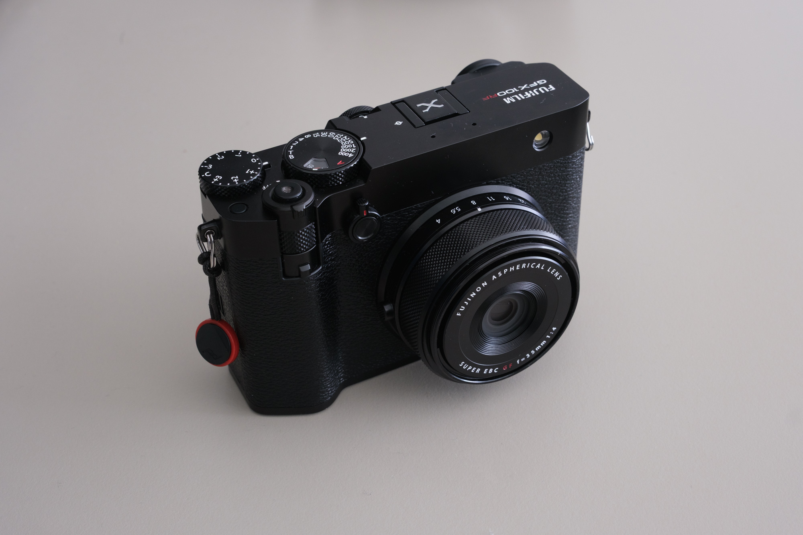

I recently decided to use the Fujifilm UK free loan system to try out the new GFX100RF fixed-lens camera. Now, I must begin by stating that this is not a camera that I intend to buy. It is simply way out of my budget. However, for reasons I'll elaborate on, I was excited to give it a go and figured it would be a useful experience regardless. This blog covers my impressions over the few days that I got to use it.

## What is the Fujifilm GFX100RF?

Essentially, the way to think about this camera is like a bigger brother to the X100 series. To summarise, the key specs are:
- 100MP Medium Format Sensor

### Addendum: What is the Fujifilm Free Loan System?